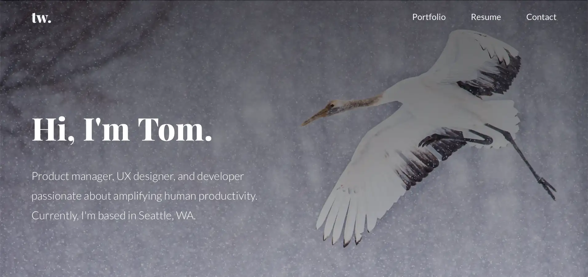

👋 Hi there!

Welcome to the code for my website [tomwionzek.com](https://tomwionzek.com).

I built it from a starter I created called [NextKey](https://github.com/tw-studio/nextkey-aws-starter). I wrote it using [Next.js](https://nextjs.org) and [Express.js](https://expressjs.com) for the server, [React](https://react.dev) and [Stitches](https://stitches.dev) for the front end, and an infrastructure written in [AWS Cloud Development Kit (CDK)](https://aws.amazon.com/cdk) for deployment.

Feel free to open issues to give me feedback or get in touch with me at [tom@tomwionzek.com](mailto:tom@tomwionzek.com).
